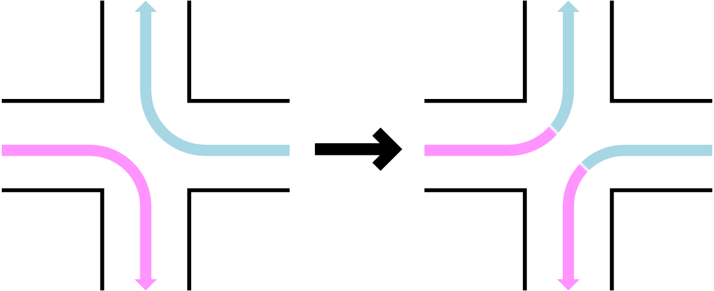
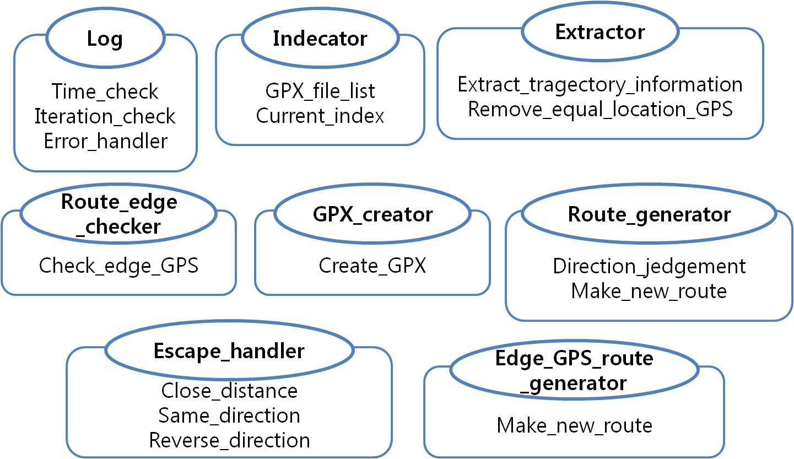
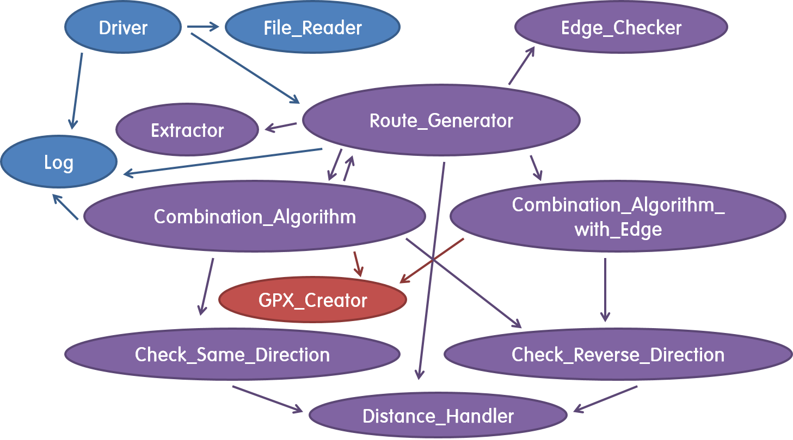
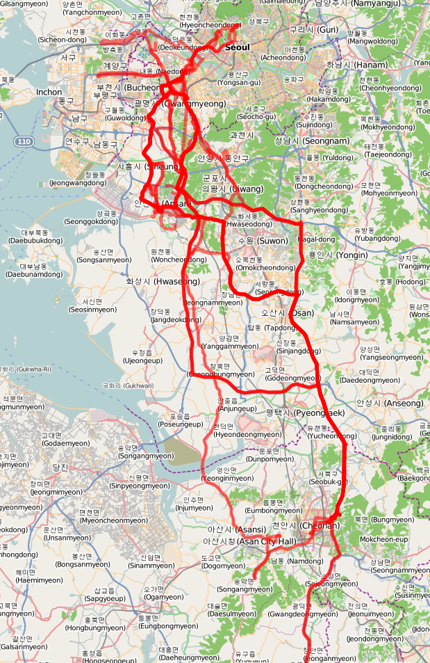
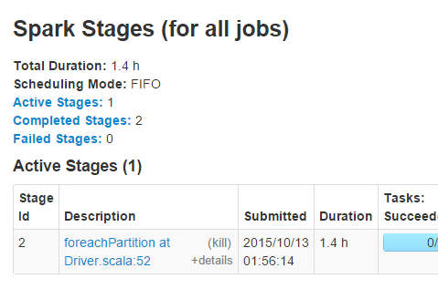
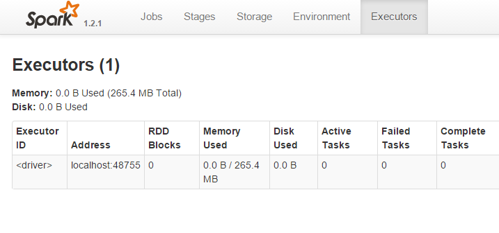
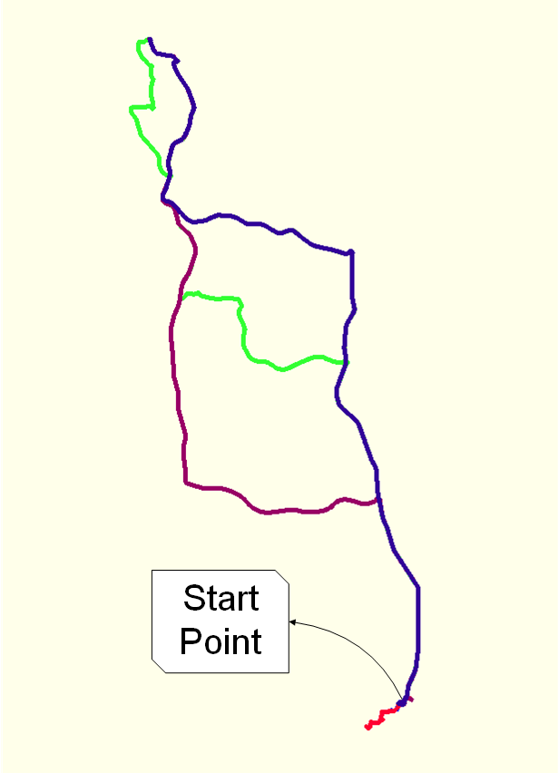
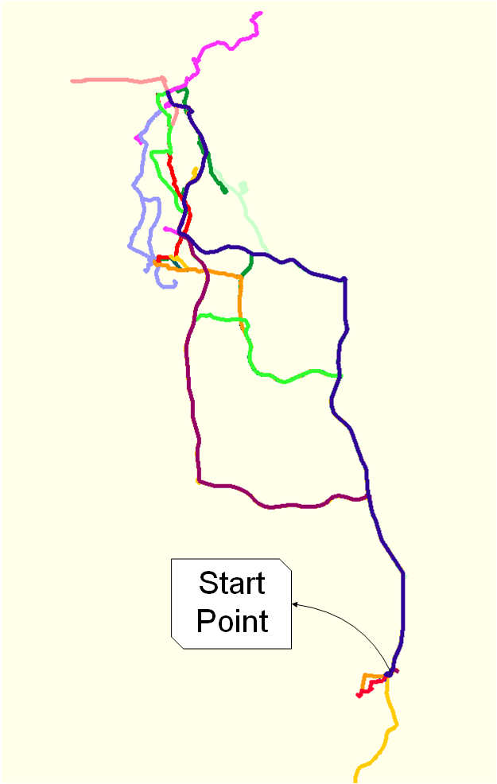

# SparkNavi  
#### A GPX trajectory combination algorithm (Spark)  
  
### Description  
This program is an implementation of the following paper:
> A Big-Data Trajectory Combination Method for Navigations using Collected Trajectory Data  
> [https://doi.org/10.9717/kmms.2016.19.2.386](https://doi.org/10.9717/kmms.2016.19.2.386)  
  
In short, this algorithm combines big trajectory data, which is GPX(GPS Xml format) file,
and generates new routes like below:  
&nbsp;  

  

  
&nbsp;  

### Prerequisite  
- Hadoop for using HDFS  
- Spark (ver. 1.2.1)
- Scala (ver. 2.10.4)  
- Java (ver. 1.7.0_75)  
  
### Overview  
The functions of each object can be defined as:  
&nbsp;  

  

  
&nbsp;  

and these objects invoke each other:  
&nbsp;  

  

  
&nbsp;  

### Input  
I collected the input data in person, using OsmAnd based on OpenStreetMap.  
- Number of GPX files : **56**  
- File size : **13.9MB**  

The following illustrates the trajectories.  
&nbsp;  

  

  
&nbsp;  

### Experiment  
Spark based on HDFS is used.  
- Run Time : 13 min 39s  

&nbsp;  

  

  
&nbsp;  
&nbsp;  

  

  
&nbsp;  

### Output  
After combination, I can find out that there are more routes from a specified start point.  
- Number of output : 19,168  
- File size : 7.11 GB  
&nbsp;  

  
  

  
&nbsp;  
